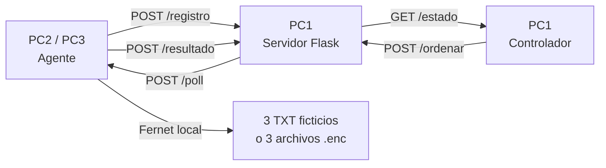

# LAB CIFRADO REMOTO PRO V5

[](https://github.com/odelvalle20/Ramxy/actions/workflows/tests.yml)
[](https://www.python.org/)
[](LICENSE)

> Laboratorio defensivo V5 para estudiar coordinación remota, cifrado reversible, telemetría y recuperación en una red aislada.

Laboratorio educativo de **cifrado y recuperación remota controlada**. La V5 añade panel web, autenticación por token, simulación previa, múltiples extensiones y conservación de los originales:

| Equipo | Función | Dirección de referencia |
| --- | --- | --- |
| PC1 | Servidor Flask + controlador | `192.168.100.10` |
| PC2 | Agente | `192.168.100.20` |
| PC3 | Agente | `192.168.100.30` |

> **Advertencia:** V5 cifra copias dentro de una carpeta de laboratorio y conserva los originales. No lo ejecutes contra datos personales, unidades de red, carpetas compartidas ni equipos no autorizados.

## Qué demuestra

```text
PC2/PC3 -> /api/agentes/registrar -> PC1
Panel web -> /api/ordenes {SIMULAR|CIFRAR_COPIAS|RECUPERAR_COPIAS} -> cola
PC2/PC3 -> /api/poll -> operación local -> /api/resultado -> PC1
```



El servidor nunca recibe shell, PowerShell, código Python ni una ruta de archivos. Solo admite tres literales: `SIMULAR`, `CIFRAR_COPIAS` y `RECUPERAR_COPIAS`.

## Qué cifra y cómo recupera

El agente trabaja dentro de `laboratorio/originales` y admite extensiones comunes de laboratorio como `.txt`, `.pdf`, `.docx`, `.jpg`, `.png`, `.csv` y `.zip`. `CIFRAR_COPIAS` escribe copias Fernet en `laboratorio/cifrados`, conserva los originales y crea un `manifest.json` con hashes SHA-256.

`RECUPERAR_COPIAS` descifra las copias hacia `laboratorio/recuperados` usando la clave local y compara los hashes contra el manifiesto. No elimina originales ni sobrescribe la carpeta de entrada.

La clave se genera en `laboratorio/claves/clave_laboratorio.key`, nunca se envía al servidor y está excluida por `.gitignore`.

`SIMULAR` solo enumera los archivos permitidos antes de cifrar. El panel web requiere `LAB_ADMIN_TOKEN` para listar agentes y crear órdenes.

## Límites deliberados

- Solo procesa extensiones permitidas dentro de `laboratorio/originales`.
- Conserva los originales y recupera en una carpeta separada.
- Sin propagación, persistencia, explotación o robo de credenciales.
- Sin ejecución arbitraria remota.
- Sin cifrado de unidades completas, perfiles, recursos compartidos o documentos reales.
- La red debe ser Host-Only/interna; nunca expongas el servidor a Internet.

## Estructura

- `servidor/servidor_lab.py`: servidor HTTP de PC1.
- `servidor/Controlador.py`: consola de PC1.
- `agente/agente_lab.py`: agente de PC2/PC3.
- `web/index.html`: panel web V5.
- `src/lab_v5/crypto.py`: simulación, cifrado de copias, manifiesto y recuperación.
- `src/lab_v5/server.py`: API autenticada, allowlist, cola y telemetría.
- `src/lab_v5/agent.py`: registro, polling y ejecución local.
- `tests/`: pruebas criptográficas, de agente y API.
- `docs/`: arquitectura, runbook y seguridad.

## Desarrollo local

```powershell
py -m venv .venv
.\.venv\Scripts\Activate.ps1
py -m pip install -r requirements-dev.txt
py -m pip install -e .
py -m pytest -q
```

La suite prueba el round-trip de cifrado/recuperación, conservación de originales, integridad por hash, autenticación, cola de órdenes y rechazo de comandos arbitrarios sin conectarse a una red real.

## Ejecución de la demo

Consulta [docs/runbook.md](docs/runbook.md) para la configuración local y [docs/v5.md](docs/v5.md) para los cambios de esta versión. Las decisiones técnicas y los límites están en [docs/architecture.md](docs/architecture.md) y [docs/security.md](docs/security.md).

## Participar

Las propuestas defensivas son bienvenidas: mejoras de observabilidad, pruebas, documentación de VirtualBox/VMware y detecciones con Sysmon o SIEM. Consulta [CONTRIBUTING.md](CONTRIBUTING.md) antes de abrir un pull request. Para errores usa las [Issues](https://github.com/odelvalle20/Ramxy/issues).

## Idiomas

- Español: este README.
- English: [README.en.md](README.en.md).
