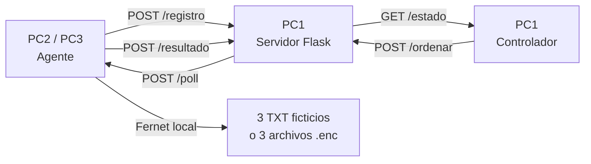

# LAB RANSOMWARE V4 DEMO

[](https://github.com/odelvalle20/Ramxy/actions/workflows/tests.yml)
[](https://www.python.org/)
[](LICENSE)

> Laboratorio defensivo para estudiar coordinación remota, cifrado reversible, telemetría y recuperación en una red aislada.

Laboratorio educativo de **cifrado y recuperación remota controlada**. Reproduce la guía V4 en una red privada con tres equipos o máquinas virtuales:

| Equipo | Función | Dirección de referencia |
| --- | --- | --- |
| PC1 | Servidor Flask + controlador | `192.168.100.10` |
| PC2 | Agente | `192.168.100.20` |
| PC3 | Agente | `192.168.100.30` |

> **Advertencia:** V4 cifra realmente, pero solo tres archivos ficticios con nombres exactos dentro de `C:\LAB_RANSOMWARE\Datos`. No lo ejecutes contra datos personales, unidades de red, carpetas compartidas ni equipos no autorizados.

## Qué demuestra

```text
PC2/PC3 -> /registro -> PC1
PC1 controlador -> /ordenar {CIFRAR_DEMO|RECUPERAR_DEMO} -> cola
PC2/PC3 -> /poll -> cifrado/descifrado Fernet local -> /resultado -> PC1
```



El servidor nunca recibe shell, PowerShell, código Python ni una ruta de archivos. Solo admite dos literales: `CIFRAR_DEMO` y `RECUPERAR_DEMO`.

## Qué cifra

El agente crea o usa exactamente estos tres archivos ficticios:

- `DEMO_LAB_documento1.txt`
- `DEMO_LAB_documento2.txt`
- `DEMO_LAB_reporte.txt`

`CIFRAR_DEMO` usa Fernet de la biblioteca `cryptography`, escribe los bytes cifrados como `.enc` y elimina el TXT original. La clave se genera y permanece en `C:\LAB_RANSOMWARE\demo.key`; nunca se envía al servidor.

`RECUPERAR_DEMO` usa esa misma clave, descifra los tres `.enc`, recrea los TXT originales y elimina los `.enc`. Si `demo.key` fue sustituida, la operación falla sin dejar un TXT descifrado parcial.

## Límites deliberados

- Lista cerrada de tres nombres, sin búsqueda recursiva.
- Solo directorio fijo `C:\LAB_RANSOMWARE\Datos`.
- Sin propagación, persistencia, explotación o robo de credenciales.
- Sin ejecución arbitraria remota.
- Sin cifrado de unidades completas, perfiles, recursos compartidos o documentos reales.
- La red debe ser Host-Only/interna; nunca expongas el servidor a Internet.

## Estructura

- `servidor/servidor_lab.py`: servidor HTTP de PC1.
- `servidor/Controlador.py`: consola de PC1.
- `agente/agente_lab.py`: agente de PC2/PC3.
- `src/lab_v4/crypto_demo.py`: Fernet, tres nombres permitidos y recuperación.
- `src/lab_v4/server.py`: API, allowlist, cola y telemetría.
- `src/lab_v4/agent.py`: registro, polling y ejecución local.
- `tests/`: pruebas criptográficas, de agente y API.
- `docs/`: arquitectura, runbook y seguridad.

## Desarrollo local

```powershell
py -m venv .venv
.\.venv\Scripts\Activate.ps1
py -m pip install -r requirements-dev.txt
py -m pip install -e .
py -m pytest -q
```

La suite prueba el round-trip de cifrado/recuperación, la clave incorrecta, el aislamiento de nombres y el contrato HTTP sin conectarse a una red real.

## Ejecución de la demo

Consulta [docs/runbook.md](docs/runbook.md) para la configuración de las tres VMs, firewall privado, servidor, controlador, agentes y PyInstaller. Las decisiones técnicas y los límites están en [docs/architecture.md](docs/architecture.md) y [docs/security.md](docs/security.md).

## Participar

Las propuestas defensivas son bienvenidas: mejoras de observabilidad, pruebas, documentación de VirtualBox/VMware y detecciones con Sysmon o SIEM. Consulta [CONTRIBUTING.md](CONTRIBUTING.md) antes de abrir un pull request. Para errores usa las [Issues](https://github.com/odelvalle20/Ramxy/issues).

## Idiomas

- Español: este README.
- English: [README.en.md](README.en.md).
