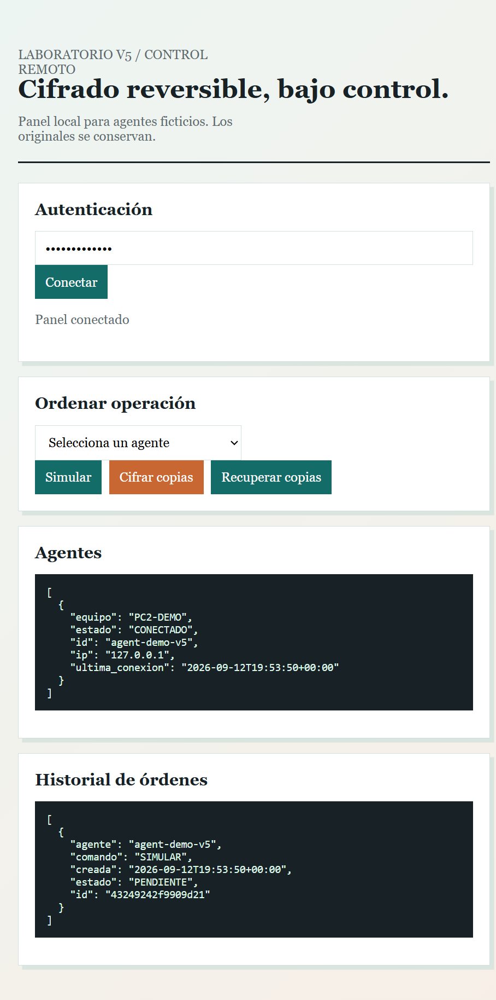
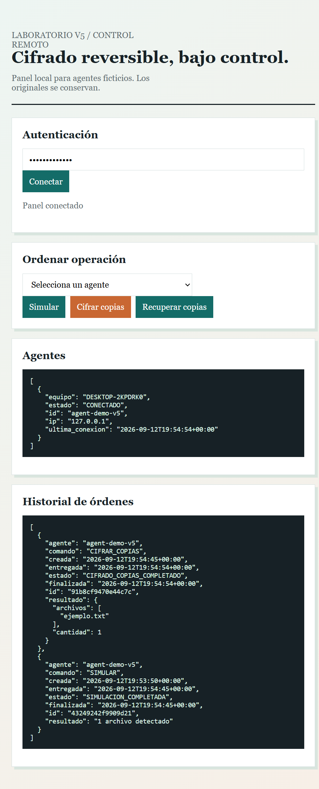

# Evidencia V5

Capturas reales del panel web V5 ejecutado en local con un agente ficticio y datos temporales.





La primera captura muestra autenticación, agente registrado y una orden pendiente. La segunda muestra el polling, `SIMULAR` completado y `CIFRAR_COPIAS` completado.

## Validación automatizada

Ejecutar:

```text
py -m pytest -q
```

La suite valida:

- cifrado Fernet de copias;
- recuperación verificada por SHA-256;
- conservación de originales;
- autenticación, cola, polling, resultado y rechazo de comandos arbitrarios;
- ejecución local del agente aunque el reporte HTTP no esté disponible.

## Evidencia manual

Captura estos estados en una red privada con archivos ficticios:

1. Agentes visibles como `CONECTADO`.
2. Archivos ficticios en `originales`.
3. Copias `.enc` y `manifest.json` después del polling.
4. Estado `CIFRADO_COPIAS_COMPLETADO`.
5. Archivos recuperados y hash coincidente.

No incluyas claves, datos personales ni rutas de usuario en las capturas.
